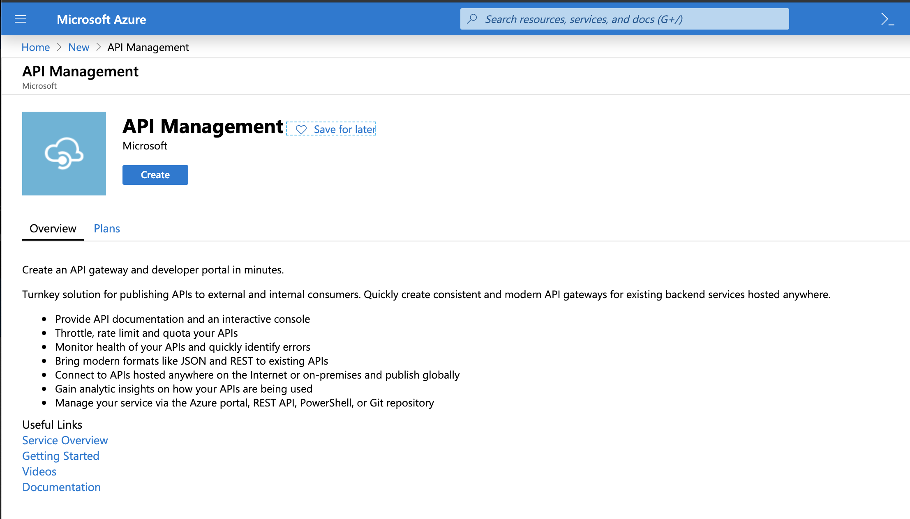
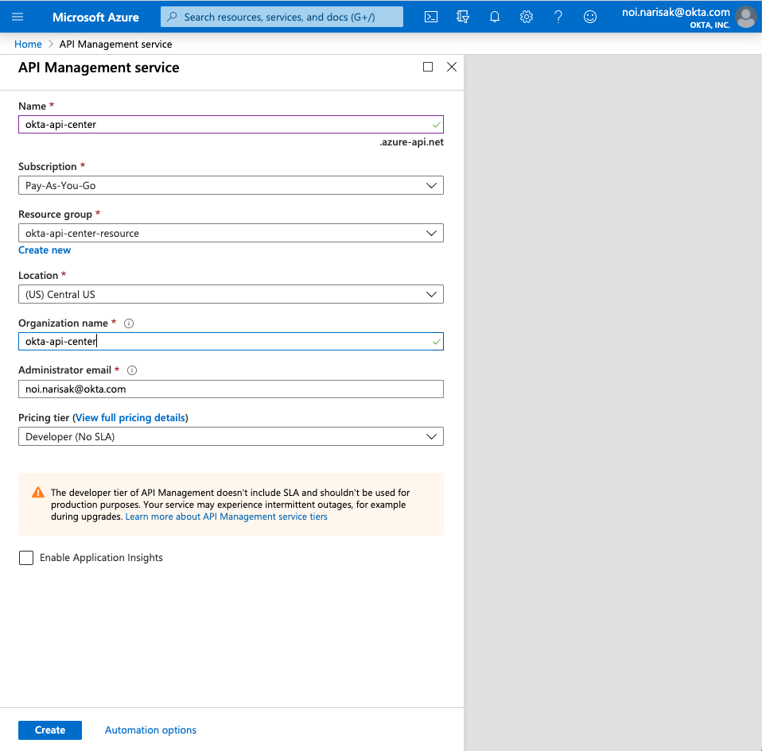
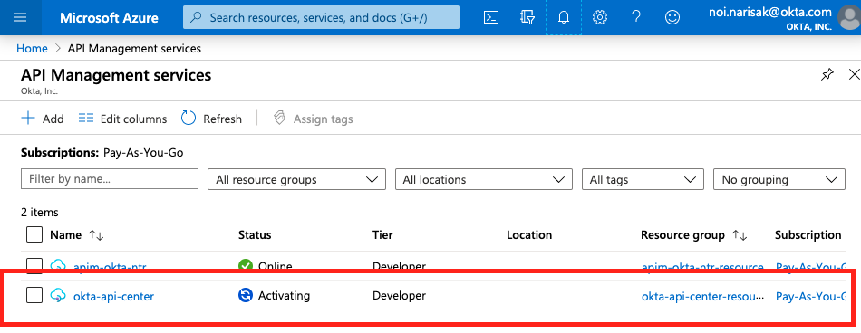
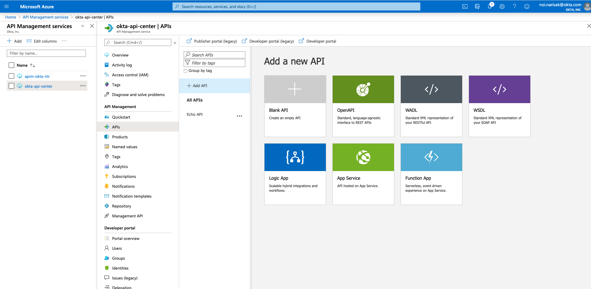
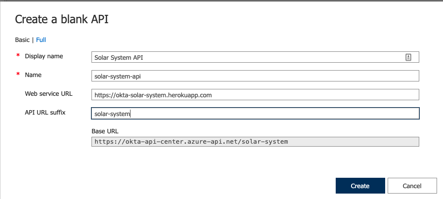
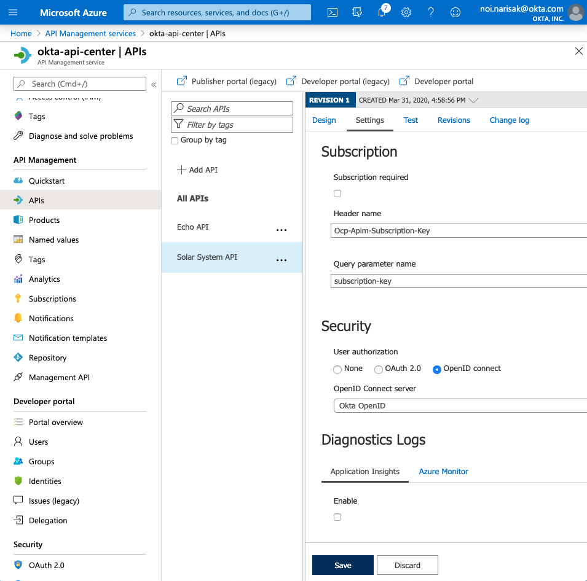
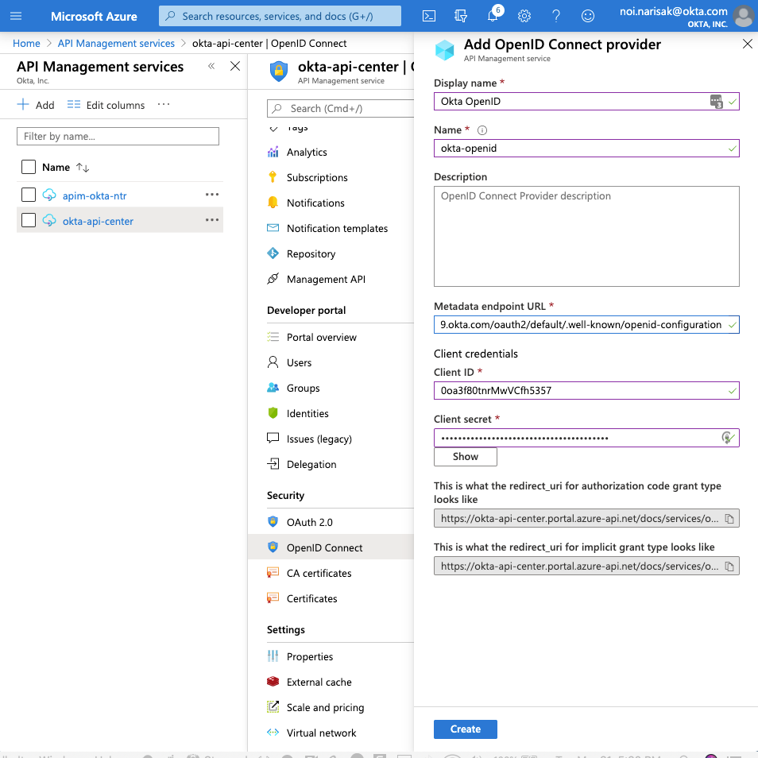
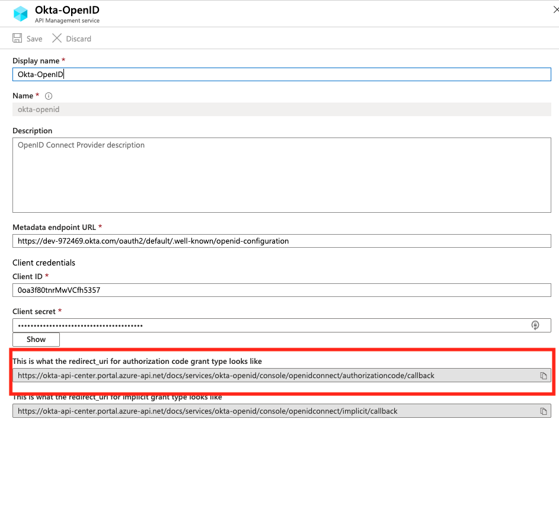
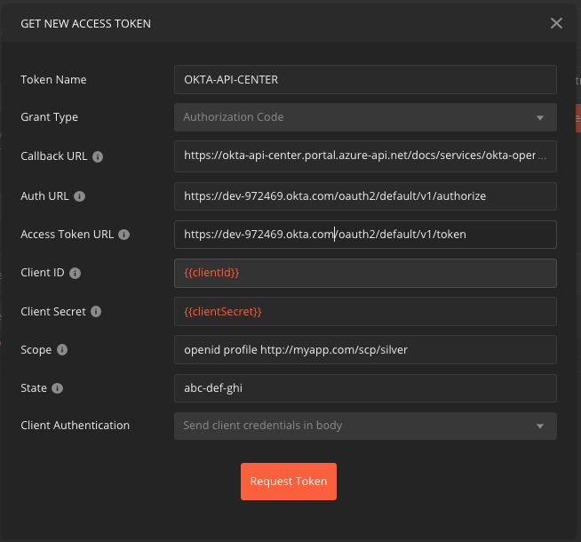

# Integrating Okta with Azure API Management

This integration guide describes how to integrate Okta's API Access Management (OAuth as a Service) with Azure API Management.

- [Integrating Okta with Azure API Management](#integrating-okta-with-azure-api-management)
	- [Prerequisites](#prerequisites)
	- [Okta](#okta)
		- [Setup Okta](#setup-okta)
	- [Azure](#azure)
		- [Set up Azure API Management](#set-up-azure-api-management)
		- [Set up your API in Azure API Management](#set-up-your-api-in-azure-api-management)
		- [Configure Azure API Management to use Okta as the external Authentication services.](#configure-azure-api-management-to-use-okta-as-the-external-authentication-services)
			- [OpenID Connect](#openid-connect)
		- [Securing API endpoint](#securing-api-endpoint)
	- [Testing](#testing)
			- [Testing with Postman](#testing-with-postman)
- [Thanks](#thanks)

## Prerequisites

* Okta development tenant
* Azure account
* Postman for testing API

## Okta

### Setup Okta

These instructions assume that you have already set up your Okta tenant and can acquire access tokens from Okta by following the instructions in the [main readme of this repo](readme.md).

As a result of those setup steps, you should have the following values on hand before proceeding:

**ISSUER**
```
example: https://dev-399486.okta.com/oauth2/default
# This value will be `https://{{OKTA_TENANT}}/oauth2/default` unless you've set up a different authorization server in Okta.
```

## Azure

### Set up Azure API Management

In your Azure instance, create a new API Management instance



Provide details like `Name`, `Resource groop`, `Location` and `pricing` details. In this article, we have created `okta-api-center` with the region/location in `US Central`.

> NOTE: Choose `Location` that fits your location.



Click Create. This will take a few minutes (> 10 Minutes) to deploy and activate.



### Set up your API in Azure API Management

Click on APIs in the left navigation pane and click '`+ Add API`'



Please copy the details show in the screenshot below to register our API that will secure later.



After the API is registered, Go to the settings section for 'Solar Systen REST API' and add more details. **IMPORTANT**: Uncheck the 'Subscription required' checkbox. This checkbox is additional functionality provided by Azure API if you plan to pubiish your API Dashboard to Developers. It's outside the scope of these insturctions, more details [here](https://docs.microsoft.com/en-us/azure/api-management/api-management-subscriptions).



Currently the API is unprotected, in the next few steps we will configure Okta as the OpenID Connect Provider and add rules in APIM to validate the access tokens.

### Configure Azure API Management to use Okta as the external Authentication services.

#### OpenID Connect

With in the `okta-api-center` menu, navigate to `Security` > `OpenID Connect`.

Click Add and then use the following values below to fill out the OpenId Connect setting page and click on Create.

| Field | Value |
| :---  | :--- 	|
| Display Name | Okta OpenID |
| Name | okta-openid |
| Metedata endpoint URL | https://dev-xxxxx.okta.com/oauth2/default/.well-known/openid-configuration |
| Client ID | Your client Id |
| Client Secret | Your client secret |



> NOTE: You need url from `This is what the redirect_uri for authorization code grant type looks like` for Postman.
>


### Securing API endpoint

Configure individual API endpoint on the Planets endpoint.

Navigate to


## Testing

> NOTE: Installation details for [Postman](https://www.postman.com/).

#### Testing with Postman

Setting OAuth 2.0. General instructions [here](https://learning.postman.com/docs/postman/sending-api-requests/authorization/#oauth-20) but the following is what will be using.

Open tab by click on `+` button and then `Authorization` tab. Select `OAuth 2.0` under Type dropdown list.


Use the following information in the `GET NEW ACCESS TOKEN` window

| Field | Value |
| :---  | :--- 	|
| Token Name | AZURE-APIM-TOKEN |
| Grant Type | Select: `Authorization Code` |
| Callback URL | https://{azure-api-name}.portal.azure-api.net/docs/services/okta-openid/console/openidconnect/authorizationcode/callback |
| Auth URL | https://dev-xxxxx.okta.com/oauth2/default/v1/authorize |
| Access Token URL | https://dev-xxxxx.okta.com/oauth2/default/v1/token |
| Client ID | Your client Id|
| Client Secret | Your client secret|
| Scope | `openid profile http://myapp.com/scp/silver` |
| State | `abcd-efgh-ijkl` |
| Client Authenication | Select: `Send client credentials in body` |



Click `Reqeust Token`. Login as `carl.sagan`.

Click `Use Token`.


Open tab and using the following values

TODO


TODO


# Thanks
* [Maneesh Sahu](https://github.com/maneeshsahu) - For his write up on Azure API Management instructions.
* [Tom Smith](https://github.com/tom-smith-okta) - For this repo! :tada: